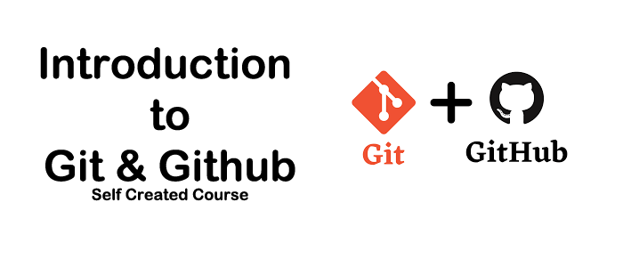

    

<h1>Module One: What Git is & Setting Git Up</h1>

Git is a Version Control System (VCS) that allows computer file to be tracked for changes, this allows clients to work within a grouped project folder and contribute changes to that project on single branches that are separate to the main/master branch.

Git was created in 2005 by Linus Torvalds, who also created Linux and the Linux kernel, git does not have any specific coding language so very coder friendly.

<h2>Installation Requirement</h2>

In this module you will be required to setup a working environment that entails installation of git and git bash, a github account and logged in to that account along with a text editor of your choice.

<h2>Module Brief</h2>

You are required to create a repository and push a folder and a file to this repository with changes made to that file. This will include at least two commits and a readme file that explains your steps. 

<h2>Steps</h2>
    
Once all components are installed please follow these step.

    
1. Create a folder by typing mkdir in to git bash and then cd in to that folder.

    
2. Create a file by typing echo hello > filename.txt.

    
3. Now type <samp style="color: #cc0">"git config --global user.name "yourname" "</samp> this is setting the workspace/folder with a git user name.

    
4. Now type "git config --global user.email "youremail@gmail.com" " this is setting the workspace/folder with a git user email.

    
5. Type "git init" and your folder's name: The git init command initializes a new git repository.
 
    
6. Type "git add" and your file's name: The git add command adds a change in the working directory and to the staging area.

    
7. Type "git commit -m "your comment based on this task.":

    
8. Type "git push -u origin master" This will push any commits from the local to the master Branch.

<h2>Conclusion</h2>
    
Onnce all step have been carried out I had my first repository with a folder and a file within that folder. Through carrying out these step a number of times there where little code hits that are very handy to know if anything goes wrong, one of the most important lines that help me a lot was "git status(obviously), git remote -v" and remembering that if I don’t "git commit -m "Comment" then nothing will be pushed. This is an easy task but for someone that is not normalised to git it can take some time to visuilize the proccess.

<h1>Module Two: Workflow & Staging</h1>
    <h2>Workflow</h2>
        
A Git workflow is a suggestion/recipe for how a team will use Git to achieve working on a project in a consistent way with a with more functionality and productivity.

        
With the option of creating single branches for individuals to work on the main project and then discus gives any project that is carried out in git is instantly given an error checking and development area before any merges to the master project.

    <h2>Staging</h2>
        
The main command to stage a file is "git add filename" this will place the file and any changes in to the staging area.

Once the files are in the staging area you can then commit them for every change you make with a comment but it is advised to try and keep your commits to every five change.

        <h3>Extra Staging Commands</h3>
            
git add --all this will add all files within the directory to the staging area.

            
git remote add takes two arguments, your remote repos name and the url of the github repository that you are adding it to.

            
git add "directory path": this will stage a specific directory or file, you need to have a file within the folder as git will not allow an empty folder to be push without a file, for tracking logs.

            
git rm filename is used to remove files or changes that are in the staging area.

            
git rm --chached filename will remove the file from the staging area only, this may need -r after rm for folders.

        <h3>The Four Stages of git(Creation, Modification, Refactoring & Deletion)</h3>
            
The creation stage is the first and can be seen as the untracked work directory.
            
The modification stage is next and can be seen as the tracked work directory.

            
The refactoring is the staging area within git and can be seen as the discussion stage.
The deletion stage is after all project files and git branches are up-to-date and merged you can then delete the sub branch with no data loss.

            
            
<h1>Module Three:  Git Status & Gitignore file</h1>
    <h2>Status</h2>
        
The git status command is one of the most used commands as it allows you to view the stage you are at and the file stage, such as Mfile.txt is modified or Dfile.txt means file has been deleted. There are a number of flags for the command that are very helpful, like status -s = status short: this will give a short output within columns and has flags RED and green colour coding such as the M AND D mentioned before.

        
Green M = Modified and staged

        
Red D = files that have been deleted.

        
Green A = files that have just been added.

        
If texted is coloured orange then this means that the branch is be hide or in front of the remote and cyan means the branch matches its remote.

    <h2>Gitignore File</h2>
        
The gitignore file is used to tell git to ignore certain file types. You can tell git to ignore folders as well as files, where this helps with security throughout the project.

        
To create the gitignore file type "echo gitignore > gitignore" with no extension.

        
To ignore folders type "foldername" within the gitignore file.

        
To ignore files type filename and extension.

        
To ignore all file types you can type "*.txt" or the file extension you want to ignore.

        
If you place a # before any text in the ignore file it will be seen as a comment within the ignore file. 

        
In the command line you can type "echo newtext >> filename.txt" and it will append the file, this is due to the >> symbol which means appending.

        
The "git mv filename" command is used to move files and can be used to rename files "rm filename.txt newfilename.txt".

    <h2>Module Three Assessment: Create a Gitignore File</h2>
        <h3>Assessment Brief</h3>
            
In this assessment you are required to create a file named FileOne.md through the git bash command line, you are then asked to create a gitignore file through the command line as well. You will then type the line you need to ignore the FileOne.md in the gitignore file; after this is complete you will add, commit and then push to the remote main branch.

            
You’re commit comments will be used to view completion so make sure to be clear on your comment.

<h1>Module Four: Diff Tools & Viewing History</h1>
    <h2>Diff Tools</h2>
    
The git diff tool is used to compare staged files with the remote files to see the changes in a one screen view.

        
Typing git config --global diff.tool "your text editor" will set your text editor to open with diff commands.

        
git config --global difftool.vscode.cmd = sets the cmd file to open.

        
git config --global difftool.vscode.cmd "code --wait" this command will stop git from processing your changes before you are finish editing.

        
git config --global difftool.vscode.cmd "code --wait --diff this set git vs code for diff files.

        
git config --global difftool.vscode.cmd "code --wait --diff $LOACL $REMOTE" = Placeholders for copies of new files.

    <h2>Viewing History</h2>
        
Checking your branch commit history can be very helpful and is used some time to help project to move forward and not double check areas.

        
"git log" will show a history of all the commits on that branch.

        
"git log --online" will show a history of the repository’s online commits.

        
"git show HEAD~1" this is one step back within the commit history.

        
Git sometimes uses other terms for objects such as a blob meaning a file and a tree meaning folder also being able to undo your last changes can be carried out by typing "git clean -fd" and this will undo local changes, the f means file and the d means directory.

    <h2>Module Four Assessment: Display your third commit log.</h2>
        <h3>Assessment Brief</h3>
            
You are required to create a file named Thirdcommit.md and place the log history from the third commit comment inside it. You are then asked to add it, commit it and then push it to the main branch, make sure you comment on this commit is clear on its purpose.

        <h3>Assessment complete:</h3>
        
commit a382fc106f6e8207d41a2f3c4f71253bc2a517aa

        
Author: Alexander Milligan <alexander0milligan@gmail.com>

        
Date:   Sun Apr 9 12:42:12 2023 +0100

        
Finished Module Two

        
diff --git a/ModuleTwo/ModuleTwo.md b/ModuleTwo/ModuleTwo.md

        
index e6a37d3..27cab33 100644

        
--- a/ModuleTwo/ModuleTwo.md

        
 +++ b/ModuleTwo/ModuleTwo.md

        
 @@ -10,5 +10,7 @@

        
git add "directory path": this will stage a specific directory or file, you need to have a file within the folder as git will not allow an empty folder to be push with out a file, for tracking logs.

        
git rm filename is used to remove files or changes that are in the staging area.

        
git rm --chached filename will remove the file from the staging
        area only, this may need -r after rm for folders.

        <h2>The Four Stages within git</h2>
            
Creation, Modification, Refactoring, and Deletion
+ 
        <h2>The Four Stages of git</h2>
            
The creation stage is the first and can be seen as the untracked work directory.

        
            
            
<h1>Module Five: Push, Merge, Pull & Fetch</h1>
    <h2>Push</h2>
        
Description: The git push command is used to upload local repository content to a remote repository. The git push command can be seen as a syncing command and a fetch and pull can be seen as a download command.

        
The default push command is "git push -u origin main"
        
git push -u origin "BranchName": This command will push any changes from the local repository to the remote repository branch.

        
git push "remote url" "BranchName": This command will push any changes from the local repository to the remote repository branch.

        
git push --all: This command will push any changes from the local repository to the remote repository branch as long as the command comes from the command line within the directory and branch.

        
git branch -D branch_name: This will delete a branch on the remote.

    <h2>Pull</h2>
        
Description: The git pull command is used to download content from your remote repository and will update your local repository. This command is two commands in one, a fetch and a merge.

        
Commands:

        
git pull

        
git pull remote

        
Fetch the specified remotes copy of the current branch and immediately merge it into the local copy

        
git pull --no-commit remote 

        

        
git pull --no-commit remote: This will integrate the remote branch with the local
    
        
git pull --rebase: This is a method of combining your local unpublished changes with the latest published changes

        
git switch BranchName

        
This will switch branches.

    <h2>Fetch Request</h2>
        
Description: Git fetch will download the remote repository.

        
Git fetch is a more safer way to get the remote files from a repository than git pull due to the fact that it does not change any of the files in the process.

        
git pull = git fetch + git merge.
 
        
The default command is: "git fetch remote-url" 
 
    <h2>Merge Request</h2>
        
Description: Git merge requests will join all development histories together from one branch to another or the main branch.

        
The git merge command can give you the power to merge specific area of the development.

        
The default comand: "git merge"

   

<h1>Module Six:  History Error Assessment</h1>
    <h2>Assessment Brief</h2>
        
This assessment is based on a git main(default) branch and a master branch, where the master branch has a history of three commits more than the main branch and the main branch has a change that was not committed. You are asked to type out step base on how to render this error and match up the histories.

    <h2>Catalyst :</h2> 
        
This problem accords mainly when an text editor is used to commit and the a command line is used to push or pull, the switch between the compiler/text editor to the command line seems to cause a history lag and then a committing error.

    <h2>Rendering Steps</h2>
        
The first step to render this error is to check that your remote master is up to date, if not then try pushing your master branch.

        
This failed and it was found that pulling the master and replacing it with the local branch would render the error and refresh the history, this would mean taking a copy of the last updated file and restoring the last master branch to the local.

        
The last step was to push the updated master branch on the local to the remote master.

        
Once this was completed and checked online (remote) merge the main with the master and all commit history errors where rendered

    <h2>Command Path</h2>
        
git pull master url

        
git merge

        
git add *

        
git commit - m "comment"

        
git push -u origin master

    <h2>Conclusion :</h2>
        
This happens due to a syncing error, the pull command on the master branch and merging the local after this syncs the repositories back to equal stats.

 

<h1>Module Seven:  Pull, Edit, Push Assessment</h1>
    <h2>Assessment Brief</h2>
    
For this assessment you will need to create a new repository named ModuleSeven, you are then required to pull this repository(https://github.com/Alexander-Milligan/ModuleSevenFolder.git)in to your repository and edit the readme to say Hello Module Seven. Save the file and add, commit and push the folder and file to your repository.

   
 Assessment Completion Link:

<h1>Module Eight:  Open Source Edit Assessment</h1>
    <h2>Assessment Brief</h2>
    
For this assessment you are required to setup a local folder with a git repo in it. 
    You are the asked to find a git project that you like and pull that project through the command line in
    to your folder and edit one of its file. 
    You are then asked to create a repo on github and push the changed project to your repo. 
   

   
 Assessment Completion Link:

 

   
   <h2>Commands: Helper</h2>
        
1. git config --global core.editor "code --wait" = 

        
git config --global -e = this will open gitconfig.

        
End of length = 

        
System = all users

        
Global = all repositories of the user

        
Local =  The current repository’s

        
git reflog = short logs

        
create a new repository on the command line
            echo "# Repo" >> README.md
            git init
            git add README.md
            git commit -m "first commit"
            git branch -M main
            git remote add origin https://github.com/Alexander-Milligan/Repo.git
            git push -u origin main
        

        
…or push an existing repository from the command line
            git remote add origin https://github.com/Alexander-Milligan/Repo.git
            git branch -M main
            git push -u origin main

